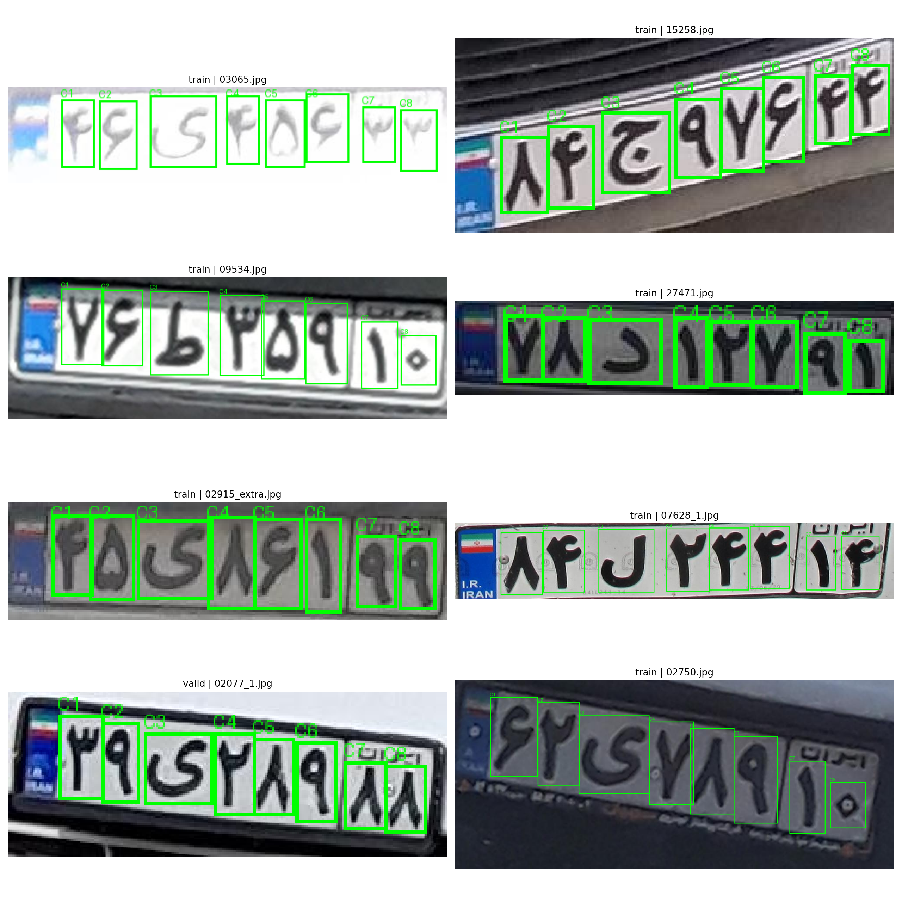

# PlateHunter
A three-stage Automatic License Plate Recognition (ALPR) pipeline for Iranian plates, built for both images and videos.

PlateHunter combines object detection, character localization, character classification, and multi-object tracking into a single practical pipeline. The system is designed to detect license plates, extract all 8 plate characters, classify each character, validate the final plate format, and maintain stable identities across video frames.

It supports Persian plate rendering, confidence-based filtering, structured output saving, and detailed training/inference reporting.

---

## Overview

This project uses a staged ALPR design instead of a single end-to-end OCR model:

1. **Plate Detector** detects the license plate region in the full image.
2. **Character Detector** localizes the 8 characters inside the cropped plate.
3. **Character Classifier** classifies each detected character into one of 32 classes.
4. **Inference Gating** validates the output using format rules and combined confidence thresholds.
5. **Video Tracker** maintains plate identities over time using motion, appearance, and OCR consistency.

This decomposition improves interpretability, debugging, and failure analysis. It also makes it easier to inspect where the pipeline fails: plate detection, character localization, character recognition, or temporal tracking.

---

## Pipeline Architecture

### Stage 1 — Plate Detection
The first model detects candidate license plates in the original image/frame and crops the plate region.

- **Model:** YOLO with `yolo26s`
- **Role:** detect plate bounding boxes
- **Output:** cropped plate candidates

### Stage 2 — Character Localization
The second model runs on the cropped plate image and detects the 8 individual characters.

- **Model:** YOLO with `yolo26x`
- **Role:** localize plate characters, not classify them
- **Output:** 8 character bounding boxes
- **Post-processing:** detected characters are sorted from left to right using their horizontal center

If the model does not detect exactly 8 characters, the plate is rejected by the final pipeline.

### Stage 3 — Character Classification
Each detected character crop is passed to a classifier to predict its class.

- **Model:** `ConvNeXt Small`
- **Initialization:** ImageNet pretrained weights
- **Classes:** 32 character classes
- **Role:** classify digits, letters, and plate symbols

---

## Example Outputs

### Model 1 — Plate Detection


### Model 2 — Character Detection


### Full Pipeline Output — Example 1


### Full Pipeline Output — Example 2


---

## OCR Logic and Plate Validation

The final OCR result is not accepted blindly. The pipeline validates both structure and confidence before returning a plate.

### Plate Format Rule
Accepted Iranian plate outputs must match this pattern:

`DD L DDD DD`

Where:
- positions `0, 1, 3, 4, 5, 6, 7` must be numeric
- position `3` must be a valid letter/symbol class

Persian and Arabic numerals are normalized before validation.

### Acceptance Conditions
A plate is accepted only if all of the following pass:

- plate detector confidence is above the configured threshold
- average character detector confidence is above the configured threshold
- average character classifier confidence is above the configured threshold
- final combined confidence is above the configured threshold
- exactly 8 characters are detected
- the final text matches the expected plate format

### Final Confidence
The final OCR confidence is computed using the geometric mean of:

- plate detection confidence
- mean character detection confidence
- mean character classification confidence

This makes low-confidence failure in any stage harder to hide — which is frankly rude to bad predictions, and correctly so.

---

## Image Inference

For a single image, the pipeline:

1. detects all plates in the image
2. crops each plate
3. detects 8 characters inside each crop
4. classifies each character
5. validates the final plate
6. draws accepted and rejected outputs on the image
7. saves reports and crops

### Visualization Behavior
- **Accepted plates** are drawn with a green box and the recognized plate text
- **Rejected plates** are drawn with a red box and the rejection reason

### Saved Outputs
Image inference saves outputs under `Saved_models/inference_outputs/` including:

- annotated images
- plate crops
- character crops
- CSV reports

---

## Video Inference and Tracking

The video pipeline extends the same OCR system with tracking so that each physical plate keeps a stable `track_id` over time.

### Tracking Components
The tracker combines:

- **Kalman Filter** for motion prediction
- **Hungarian Matching** for assignment
- **IoU / center / size gating** for geometric consistency
- **Appearance features** for re-identification support
- **OCR hints and OCR voting** for text consistency

### Motion Model
A constant-velocity 8D Kalman filter is used:

- **state:** `[cx, cy, w, h, vx, vy, vw, vh]`
- **measurement:** `[cx, cy, w, h]`

This helps preserve stable track locations even when detections are temporarily noisy or missing.

### Matching Strategy
Track-to-detection assignment is performed in multiple rounds:

1. confirmed tracks are matched with high-confidence detections
2. tentative tracks are matched with remaining high-confidence detections
3. remaining unmatched tracks are matched with lower-confidence detections

Matching scores combine:

- IoU
- center-distance score
- size similarity
- detection confidence
- appearance similarity
- OCR text similarity

Hungarian assignment is applied on the resulting cost matrix.

### OCR Stability Across Frames
Each track keeps an OCR history. Instead of trusting one lucky frame, the tracker maintains:

- best OCR result
- top-k OCR history
- consensus text from repeated observations

Consensus ranking uses count and confidence statistics, which helps stabilize text over long sequences.

### Video Outputs
For video inference, the pipeline produces:

- annotated output video
- per-frame CSV report
- per-track summary CSV

Saved reports include fields such as:

- frame index
- track id
- plate bounding box
- detection confidence
- current OCR result
- best OCR result
- consensus text
- consensus confidence

---

## Persian Text Rendering

To display Persian plate text correctly on output images, the project uses:

- `arabic_reshaper`
- `python-bidi`
- `Vazirmatn-Regular.ttf`

This is necessary because direct rendering of Persian text often breaks shaping and directionality. Computers are very confident creatures; they will happily render text incorrectly unless forced to behave.

---

## Training Summary

### Detector Models
The two detection stages are trained as separate YOLO models:

- **Model 1:** plate detector with `yolo26s`
- **Model 2:** character detector with `yolo26x`

### Classifier Model
The character recognizer uses:

- **Architecture:** `ConvNeXt Small`
- **Pretraining:** ImageNet
- **Optimization:** `AdamW`
- **Regularization:** label smoothing

### Reporting
The training pipeline generates structured artifacts such as:

- saved model weights
- CSV metrics
- plots
- confusion-related diagnostics
- misclassification gallery

All outputs are organized under `Saved_models/`.

---

## Device Support

The project is developed with Apple Silicon compatibility in mind.

### Supported Execution
- `MPS` for PyTorch inference/training
- CPU fallback where supported
- separate device handling for:
  - PyTorch classifier
  - Ultralytics YOLO models

This makes the pipeline usable on macOS systems without requiring CUDA.

---

## Output Structure

All major artifacts are organized under `Saved_models/`.

Typical outputs include:
```text
Saved_models/
├── model_1/
├── model_2/
├── model_3/
└── inference_outputs/
├── images/
├── videos/
├── crops/
└── reports/

This structure keeps trained weights, visual results, reports, and crops separated cleanly.

---

## Project Features

- three-stage ALPR pipeline
- dedicated detector for plates
- dedicated detector for 8 plate characters
- ConvNeXt-based character classification
- format-aware OCR validation
- confidence-based acceptance gating
- Persian text rendering for output images
- image and video inference support
- Kalman + Hungarian multi-object tracking
- OCR consensus voting for stable video results
- organized training and inference artifacts
- detailed CSV reporting and error analysis

---

## Inference Configuration

The project includes a configurable inference setup through `InferenceConfig`, which controls things like:

- model weight paths
- confidence thresholds
- format validation rules
- output saving options
- OCR acceptance thresholds
- tracking thresholds
- Kalman filter noise parameters
- OCR rerun intervals for video
- appearance feature settings
- video frame stride and output FPS

This makes the pipeline easier to tune without rewriting core logic.

---

## Expected Workflow

### For Images
- load the three trained models
- run plate detection
- crop plate regions
- run character detection
- crop character regions
- run character classification
- validate final text
- save visualization, crops, and CSV report

### For Videos
- read frames using OpenCV
- detect plates on selected frames
- update tracks
- run OCR on tracked plates at controlled intervals
- maintain best and consensus OCR per track
- write annotated video
- export frame-level and track-level reports

---

## Limitations

- the pipeline expects Iranian plate structure and formatting rules
- stage 2 assumes exactly 8 detected characters for a valid plate
- performance depends on crop quality from the first detector
- unusual plate styles, occlusion, blur, extreme viewing angles, or severe lighting can reduce accuracy
- appearance-based tracking quality depends on crop quality and visual consistency across frames

---

## Repository Notes

This repository contains:

- training code for all three models
- inference code for both images and videos
- tracking logic for multi-frame plate identity preservation
- output management for weights, plots, reports, and crops

If you are reproducing results, make sure the trained weights and font assets are placed in the expected paths used by the inference configuration.

---

## Suggested Repository Name

**Primary suggestion:** `PlateHunter`

Why this name works:
- short and memorable
- sounds technical without trying too hard
- fits both image inference and video tracking
- still readable and professional on GitHub

If you ever want a slightly more engineering-flavored alternative, these also work:
- `TrackPlate`
- `PlateFlow`
- `PlateStack`
- `PlateTrace`

But honestly, `PlateHunter` is the cleanest choice here.

---

## License / Usage Note

The datasets used for training are not included in this repository because they are part of a private fine-tuned dataset.

The source code in this repository may be used, modified, and adapted freely, including for training and evaluation on your own datasets.

Trained model weights are not included in this repository.
