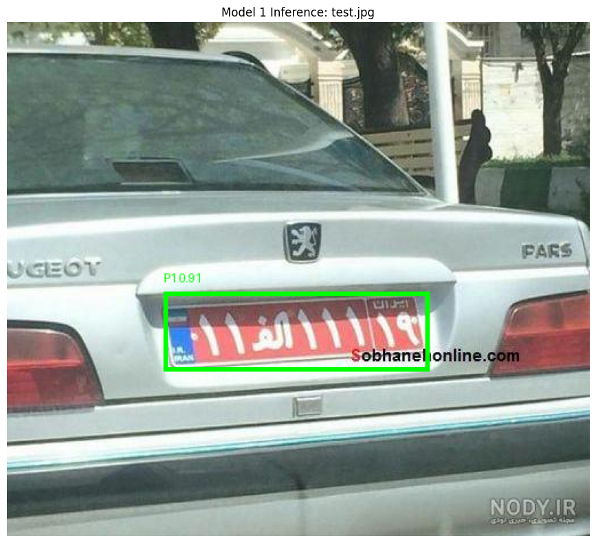
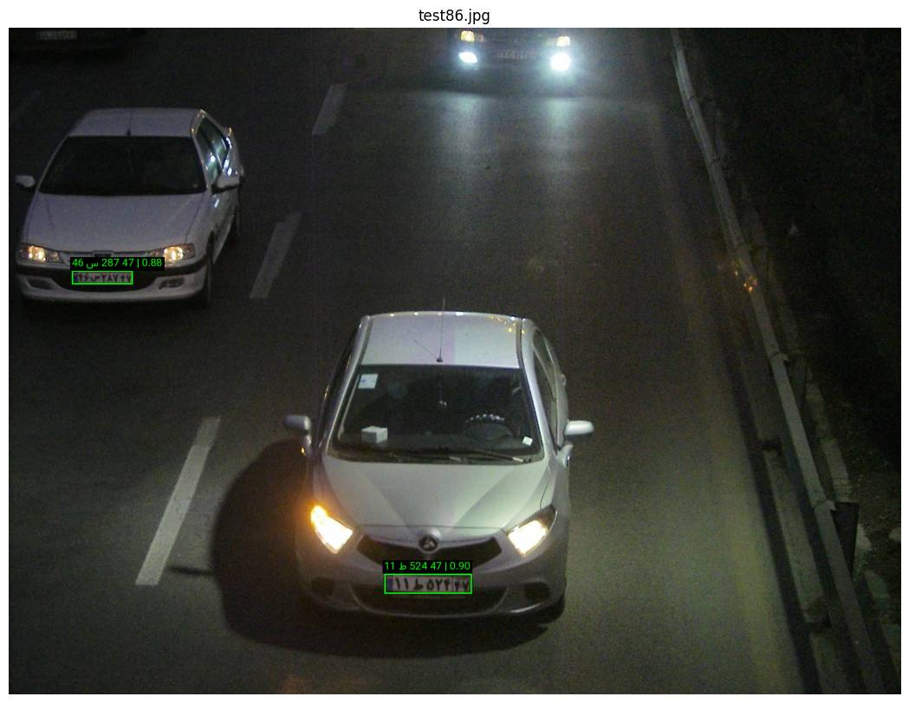
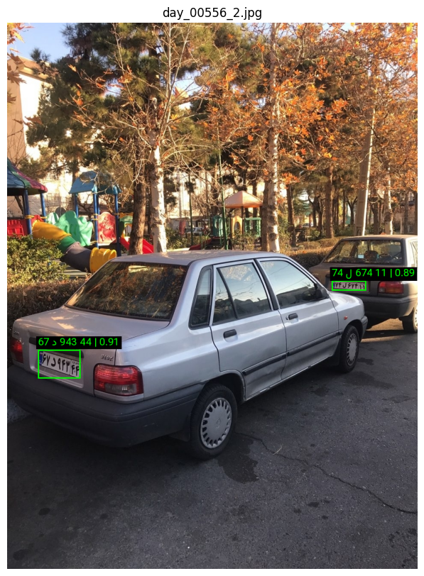

# Iranian License Plate Detection and Recognition

A complete end-to-end Automatic License Plate Recognition (ALPR) pipeline for Iranian license plates.

This project detects one or multiple license plates in an image or video frame, crops each plate, detects all eight plate characters, sorts them in the correct reading order, and finally recognizes each character to produce the full Persian plate number.

The final output looks like this:
```text
۲۰ ۸۷۹ ب ۹۰

The system is built as a three-stage deep learning pipeline:

1. **Plate Detection**
2. **Character Detection**
3. **Character Recognition**

The models are connected together in `inference.ipynb`, which supports both image and video inference. For video input, the system can also track detected plates across frames and assign a unique ID to each plate.

---

## Demo

### Plate Detection Output



### Character Detection Output



### Full Pipeline Output - Image Example


### Full Pipeline Output - Another Example



---

## Project Overview

Iranian license plate recognition is more challenging than simple object detection because a complete solution needs to handle several steps reliably:

- Detecting plates in different image conditions
- Supporting multiple plates in the same frame
- Cropping each plate accurately
- Finding all eight characters inside the plate
- Sorting characters in the correct logical order
- Recognizing Persian digits and letters
- Reconstructing the final readable plate text
- Tracking plates across video frames

This project solves the problem using a modular three-model architecture. Each model focuses on one specific task, which makes the pipeline easier to train, debug, improve, and replace.

---

## Pipeline Architecture

text
Input Image / Video Frame
|
v
+-----------------------+
| Model 1               |
| Plate Detector        |
| YOLO 26s              |
+-----------------------+
|
| Cropped plate images
v
+-----------------------+
| Model 2               |
| Character Detector    |
| YOLO 26l              |
+-----------------------+
|
| 8 sorted character crops
v
+-----------------------+
| Model 3               |
| Character Classifier  |
| ConvNeXt Small        |
+-----------------------+
|
v
Final Plate Text

---

## Model 1: License Plate Detection

The first model is responsible for locating every license plate in the input image or video frame.

It receives the original image/frame and returns bounding boxes around all detected plates. Each detected plate is then cropped and passed to the second model.

### Model

- **Architecture:** YOLO 26s
- **Task:** Object detection
- **Input:** Full image or video frame
- **Output:** Bounding boxes for all detected license plates
- **Result:** Cropped plate images

### Responsibilities

- Detect one or multiple plates in a single image
- Work on both images and video frames
- Crop detected plates for the next stage
- Preserve plate regions with enough visual detail for character detection

---

## Model 2: Character Detection

The second model receives cropped license plate images from Model 1.

Its job is not to recognize the characters. Instead, it detects the location of each character inside the plate and crops them individually.

For an Iranian plate, the model extracts all eight characters and sorts them from left to right in the following structure:

text
C1 C2 C3 C4 C5 C6 C7 C8

### Model

- **Architecture:** YOLO 26l
- **Task:** Character-level object detection
- **Input:** Cropped license plate image
- **Output:** Bounding boxes for plate characters
- **Result:** Eight sorted character crops

### Responsibilities

- Detect the eight visible plate characters
- Crop each character region
- Sort character crops from left to right
- Prepare normalized character images for classification

This separation makes the recognition process more robust. Instead of trying to read the entire plate at once, the system breaks the plate into clean character-level inputs.

---

## Model 3: Character Recognition

The third model receives the eight cropped character images generated by Model 2.

It classifies each crop and predicts the actual Persian digit or letter inside it.

### Model

- **Architecture:** ConvNeXt Small
- **Task:** Image classification
- **Input:** Individual cropped character image
- **Output:** Character class prediction
- **Result:** Final recognized plate text

### Responsibilities

- Recognize Persian digits
- Recognize supported Iranian plate letters
- Convert eight classified crops into a readable plate string
- Reconstruct the final plate format

Example final output:

text
۲۰ ۸۷۹ ب ۹۰

---

## Inference Pipeline

The complete pipeline is implemented in:

text
inference.ipynb

This notebook connects all three models into one inference workflow.

### Image Inference

For image input, the pipeline:

1. Loads the input image
2. Detects all license plates using Model 1
3. Crops each detected plate
4. Detects all eight characters using Model 2
5. Sorts character crops from left to right
6. Classifies each character using Model 3
7. Draws the final result on the image
8. Returns the recognized plate text

### Video Inference

For video input, the pipeline works frame by frame.

In addition to plate detection and recognition, the video mode can track plates across frames and assign a unique ID to each detected plate.

This makes the output more stable and useful for real-world scenarios where the same vehicle appears across multiple frames.

### Video Mode Features

- Frame-by-frame plate detection
- Multi-plate support
- Plate tracking
- Unique ID assignment per tracked plate
- Recognition result overlay
- End-to-end video output generation

---

## Repository Structure

A suggested structure for this repository:

text
.
├── model_1.ipynb              # Plate detection training / evaluation notebook
├── model_2.ipynb              # Character detection training / evaluation notebook
├── model_3.ipynb              # Character recognition training / evaluation notebook
├── inference.ipynb            # End-to-end inference pipeline
├── models/                    # Trained model weights
│   ├── plate_detector.pt
│   ├── character_detector.pt
│   └── character_classifier.pth
├── assets/                    # README images and demo outputs
│   ├── model_1_output.png
│   ├── model_2_output.png
│   ├── full_pipeline_output_1.png
│   └── full_pipeline_output_2.png
├── inputs/                    # Sample input images/videos
├── outputs/                   # Generated inference outputs
└── README.md

You can change the model weight names based on your actual exported files.

---

## Installation

Clone the repository:

bash
git clone https://github.com/your-username/iranian-license-plate-recognition.git
cd iranian-license-plate-recognition

Create a virtual environment:

bash
python -m venv venv

Activate it:

bash
# Linux / macOS
source venv/bin/activate

# Windows
venv\Scripts\activate

Install dependencies:

bash
pip install -r requirements.txt

If you do not have a `requirements.txt` file yet, install the main dependencies manually:

bash
pip install ultralytics opencv-python torch torchvision numpy matplotlib pillow tqdm

Depending on your environment, you may also need:

bash
pip install jupyter notebook

---

## Usage

Open the inference notebook:

bash
jupyter notebook inference.ipynb

Then configure the paths for:

- Plate detector weights
- Character detector weights
- Character classifier weights
- Input image or video
- Output directory

Run the notebook cells to perform inference.

---

## Image Inference Example

The image pipeline detects every visible plate and returns recognized plate text for each one.

Example output:

text
Detected Plate 1: ۲۰ ۸۷۹ ب ۹۰
Detected Plate 2: ۳۵ ۲۴۱ د ۷۷

The final image can include:

- Plate bounding boxes
- Recognized plate text
- Confidence-based predictions
- Multiple detected plates

---

## Video Inference Example

In video mode, the system can detect, recognize, and track plates over time.

Example output:

text
ID 1: ۲۰ ۸۷۹ ب ۹۰
ID 2: ۳۵ ۲۴۱ د ۷۷

Each tracked plate receives a unique ID, making it easier to follow the same vehicle across consecutive frames.

---

## Why Three Separate Models?

A single end-to-end OCR model can work for some scenarios, but this project uses a staged approach for better control and reliability.

### Benefits

- **Better localization:** Plate detection and character detection are optimized separately.
- **Cleaner recognition:** The classifier receives focused character crops instead of full plate images.
- **Easier debugging:** Each stage can be tested independently.
- **Modular improvement:** Any model can be replaced without rewriting the entire system.
- **Multi-plate support:** The first model detects all plates before recognition starts.
- **Video-ready design:** Detection and tracking can be combined cleanly.

---

## Supported Input Types

The pipeline supports:

- Images
- Video files
- Frames extracted from video streams

Common image formats:

text
.png
.jpeg
.png
.bmp

Common video formats:

text
.mp4
.avi
.mov
.mkv

---

## Output Format

The final recognized Iranian plate is reconstructed in a readable Persian format.

Example:

text
۲۰ ۸۷۹ ب ۹۰

Internally, the character detector sorts crops as:

text
C1 C2 C3 C4 C5 C6 C7 C8

Then the classifier predicts the value of each character and the final formatter converts them into the displayed plate structure.

---

## Notebooks

### `model_1.ipynb`

Contains the workflow for the license plate detection model.

Main purpose:

- Train or evaluate the plate detector
- Detect plate bounding boxes
- Generate cropped plate regions
- Prepare output for the character detection stage

### `model_2.ipynb`

Contains the workflow for detecting individual characters inside a cropped license plate.

Main purpose:

- Train or evaluate the character detector
- Detect all eight character regions
- Crop character images
- Sort character positions from left to right

### `model_3.ipynb`

Contains the workflow for recognizing cropped plate characters.

Main purpose:

- Train or evaluate the ConvNeXt Small classifier
- Classify Persian digits and letters
- Convert character crops into predicted labels

### `inference.ipynb`

Contains the complete end-to-end inference pipeline.

Main purpose:

- Load all trained models
- Run image inference
- Run video inference
- Track plates in video
- Draw results
- Generate final recognized plate text

---

## Results

The system can:

- Detect multiple plates in a single image
- Crop each detected plate
- Detect eight characters per plate
- Sort characters correctly
- Recognize Persian plate characters
- Return a final readable plate number
- Track plates in video mode

Example:

text
Input:  vehicle image or video frame
Output: ۲۰ ۸۷۹ ب ۹۰

---

## Limitations

The system may produce weaker results when:

- The plate is heavily blurred
- The plate is too small in the frame
- Lighting conditions are poor
- The plate is strongly rotated or occluded
- Characters are damaged or visually distorted
- The detector fails to crop the plate accurately

Performance can be improved by adding more diverse training data, especially for night scenes, motion blur, low-resolution footage, and angled plates.

---

## Future Improvements

Possible next steps:

- Export the full pipeline as a Python package
- Add a command-line interface
- Add real-time webcam inference
- Add REST API support with FastAPI
- Add Docker support
- Add benchmark metrics for each model
- Improve tracking stability in crowded scenes
- Add confidence filtering and result smoothing
- Export models to ONNX for faster deployment
- Build a small web dashboard for uploading images and videos

---

## Tech Stack

- Python
- PyTorch
- YOLO 26s
- YOLO 26l
- ConvNeXt Small
- OpenCV
- Jupyter Notebook

---

## Acknowledgements

This project was built as a complete Iranian license plate detection and recognition pipeline, combining object detection, character detection, image classification, and video tracking into a single practical ALPR system.

---

## License

Add your preferred license here.

For example:

text
MIT License

---

## Author

Developed by **Your Name**.

GitHub: [@your-username](https://github.com/your-username) 
